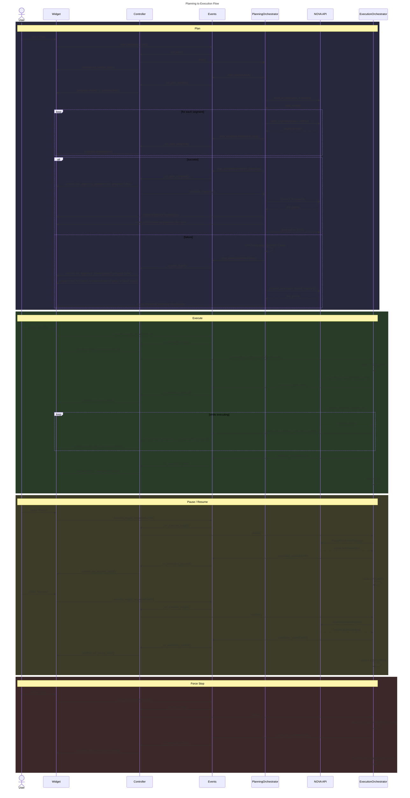

```mermaid
sequenceDiagram
    title Planning to Execution Flow

    actor User
    participant Widget
    participant Controller
    participant Events
    participant Planner as PlanningOrchestrator
    participant API as NOVA API
    participant Executor as ExecutionOrchestrator

    rect rgb(40, 40, 60)
    Note over User,Executor: Plan
    User->>Widget: clicks "Plan"
    Widget->>Events: plan_requested.emit()
    Events->>Controller: _on_plan()
    Controller->>Planner: plan()
    Controller->>Widget: controls.set_cancel_label()
    Planner->>Events: plan_started.emit()
    Events->>Controller: _on_plan_started()
    Controller->>Widget: progress.show(0.0), preview.hide()

    Planner->>API: fetch_ik (start pose, if needed)
    API-->>Planner: joint_configs

    loop for each segment
        Planner->>API: plan_trajectory(poses, settings, ...)
        API-->>Planner: segment result
        Planner->>Events: plan_progress.emit(value, msg)
        Events->>Controller: _on_plan_progress()
        Controller->>Widget: progress.update(value)
    end

    alt success
        Planner->>Events: plan_complete.emit(joint_trajectory)
        Events->>Controller: _on_plan_complete()
        Controller->>Widget: controls.set_trajectory_planned(true), progress.hide()
        Controller->>Planner: visualize_trajectory()
        Planner->>API: forward_kinematics
        API-->>Planner: tcp_poses
        Planner->>Widget: create trajectory visualization
        Planner->>Widget: mark collision-free via points on the curve
        Planner->>API: store skill to NOVA
    else failure
        Planner->>Planner: mark failing pose (planned = false)
        Planner->>Events: plan_failed.emit(PlanFailure)
        Events->>Controller: _on_plan_failed()
        Controller->>Widget: controls.set_trajectory_planned(false), progress.hide()
        Controller->>Widget: progress.set_hint(error), preview.show(red ghost at failed joints)
        Planner->>API: forward_kinematics (partial trajectory)
        API-->>Planner: tcp_poses
        Planner->>Widget: create red partial trajectory visualization
    end
    end

    rect rgb(40, 60, 40)
    Note over User,Executor: Execute
    User->>Widget: clicks "Execute"
    Widget->>Events: execute_toggle_requested.emit()
    Events->>Controller: _on_execute_toggle()
    Controller->>Widget: preview.hide(), progress.show(0.05)
    Controller->>Executor: execute(joint_trajectory, num_commands)

    Executor->>Executor: state = EXECUTING
    Executor->>API: set_motion_group_state(start_joints)
    Executor->>Events: execution_started.emit()
    Events->>Controller: _on_execution_started()
    Controller->>Widget: controls.set_pause_label()

    Executor->>API: execute_trajectory (websocket)

    loop while executing
        API-->>Executor: location update
        Executor->>Events: execution_location + execution_progress
        Events->>Controller: _on_execution_location() + _on_execution_progress()
        Controller->>Widget: update pose highlight, progress.update()
    end

    Executor->>Events: execution_complete.emit()
    Events->>Controller: _on_execution_done()
    Controller->>Widget: progress.hide(), reset pose highlight
    Executor->>Executor: state = IDLE
    end

    rect rgb(60, 60, 40)
    Note over User,Executor: Pause / Resume
    User->>Widget: clicks "Pause"
    Widget->>Events: execute_toggle_requested.emit()
    Events->>Controller: _on_execute_toggle()
    Controller->>Executor: pause()
    Executor->>API: PauseMovementRequest
    API-->>Executor: pause acknowledged
    Executor->>Events: execution_paused.emit()
    Events->>Controller: _on_execution_paused()
    Controller->>Widget: controls.set_resume_label()
    Executor->>Executor: state = PAUSED

    User->>Widget: clicks "Resume"
    Widget->>Events: execute_toggle_requested.emit()
    Events->>Controller: _on_execute_toggle()
    Controller->>Executor: resume()
    Executor->>API: StartMovementRequest
    API-->>Executor: resume acknowledged
    Executor->>Events: execution_started.emit()
    Events->>Controller: _on_execution_started()
    Controller->>Widget: controls.set_pause_label()
    Executor->>Executor: state = EXECUTING
    end

    rect rgb(60, 40, 40)
    Note over User,Executor: Force Stop
    User->>Widget: clicks "Stop"
    Widget->>Events: force_stop_requested.emit()
    Events->>Controller: _on_force_stop()
    Controller->>Executor: stop()
    Executor->>Executor: cancel task, state = TEARING_DOWN
    Executor->>Events: execution_cancelled.emit()
    Events->>Controller: _on_execution_done()
    Controller->>Widget: progress.hide(), reset pose highlight
    Executor->>Executor: background cleanup, state = IDLE
    end
```
